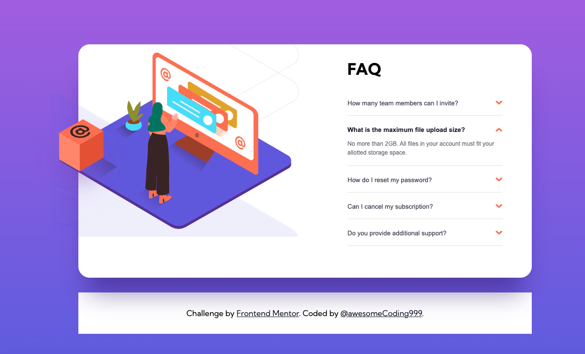
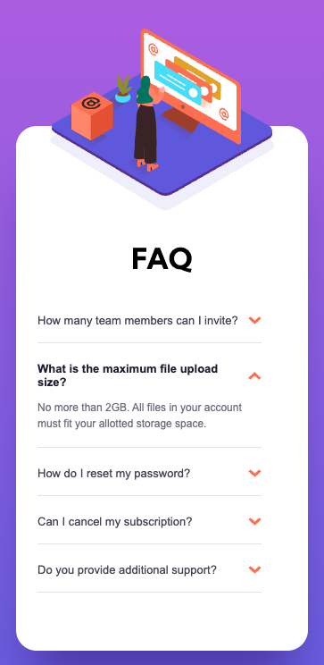

# Frontend Mentor - FAQ accordion card solution<!-- omit in toc -->

## Desktop<!-- omit in toc -->

## Mobile<!-- omit in toc -->

## Table of contents<!-- omit in toc -->

- [Overview](#overview)
  - [The challenge](#the-challenge)
  - [Links](#links)
- [My process](#my-process)
  - [Built with](#built-with)
  - [What I learned](#what-i-learned)
- [Author](#author)

## Overview

### The challenge

Users should be able to:

- View the optimal layout for the component depending on their device's screen size
- See hover states for all interactive elements on the page
- Hide/Show the answer to a question when the question is clicked

### Links

- [GitHub repo](https://github.com/awesomeCoding999/frontend-mentor-faq-card)
- [Live site](https://frontend-mentor-faq-card-liart.vercel.app/)

## My process

### Built with

- Semantic HTML5 markup
- CSS custom properties
- Flexbox
- Mobile-first workflow
- [React](https://reactjs.org/) - JS library
- [TypeScript](https://www.typescriptlang.org/) - Type safety for JavaScript

### What I learned

I learned some more about positioning in respects to absolute and relative positions for the images in the card.

## Author

- Frontend Mentor - [@awesomeCoding999](https://www.frontendmentor.io/profile/awesomeCoding999)
